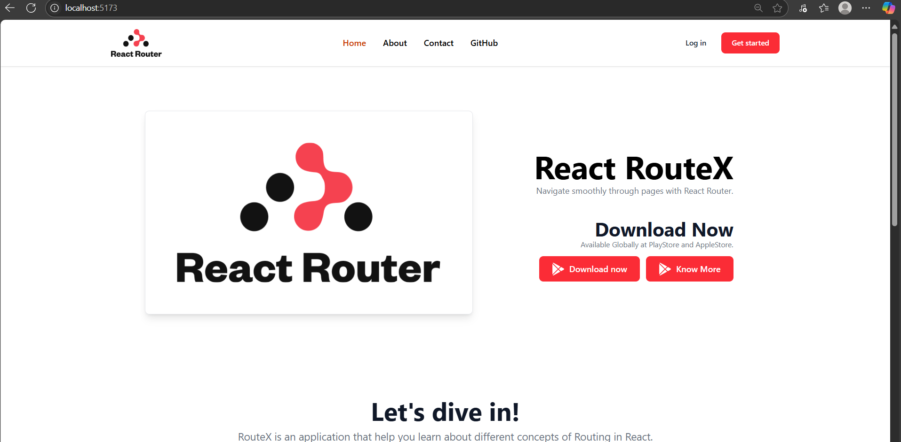
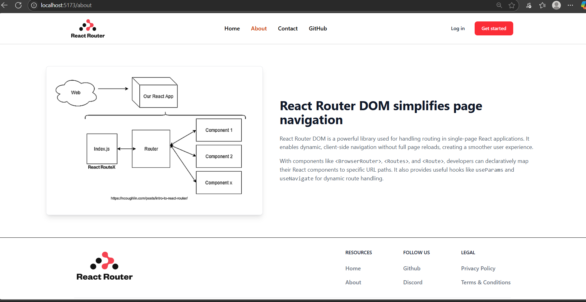
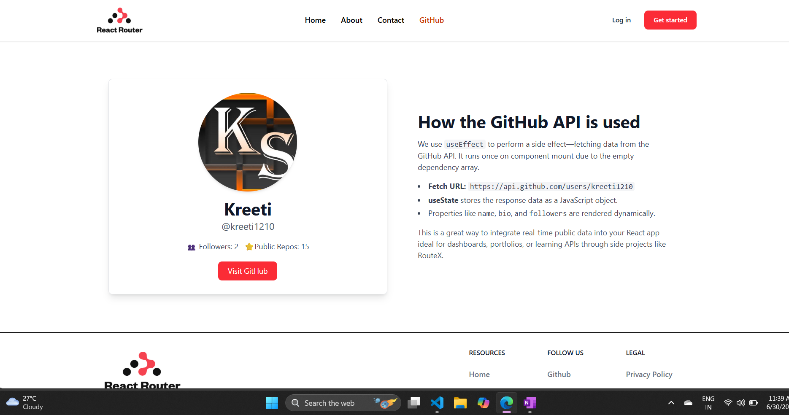
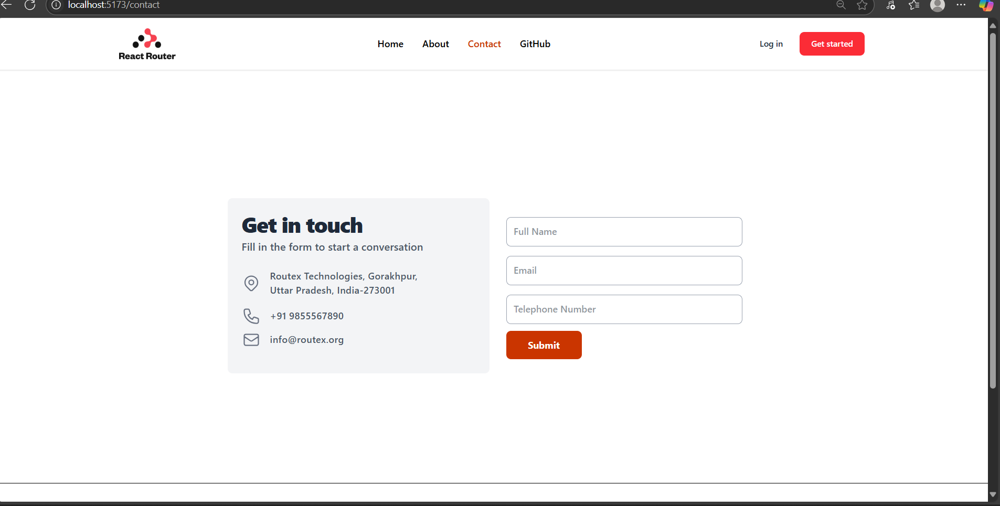

# React RouteX

**Navigate smoothly through pages with React Router.**

RouteX is a simple and interactive single-page application built to help developers understand the fundamentals of routing in React. From basic navigation to programmatic redirection, this app showcases core features of `react-router-dom` with clean UI and practical examples.

---

## 🚀 Features

- 📌 **Route Mapping**  
  Learn how `<Route>` connects URL paths to components using `path` and `element` props.

- 🔗 **Client-side Navigation**  
  Explore how `<Link>` enables seamless transitions without full-page reloads.

- 🧭 **Github api calling**  
  Using github api to fetch info from your github profile in your React apps.

- 📱 **Responsive Design**  
  Crafted with Tailwind CSS for a clean, mobile-friendly interface.

---

## 🛠️ Built With

- React.js
- React Router DOM
- Tailwind CSS


---

## 🧑‍💻 Getting Started

Clone the repository and install dependencies:

```bash
git clone https://github.com/kreeti1210/React-Routex.git
cd React-Routex
npm install
npm run dev

```

---

### Our Weblook

 - https://react-routex.vercel.app/








